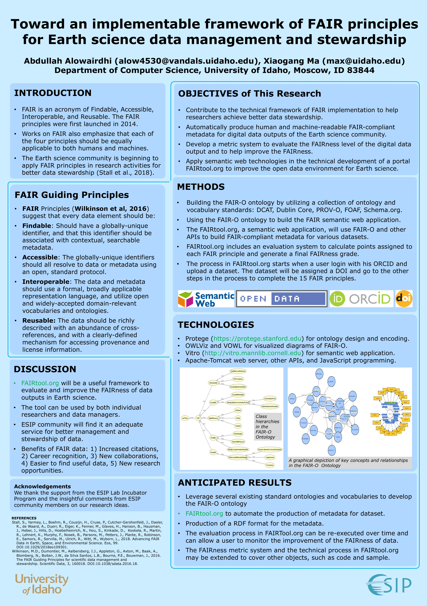
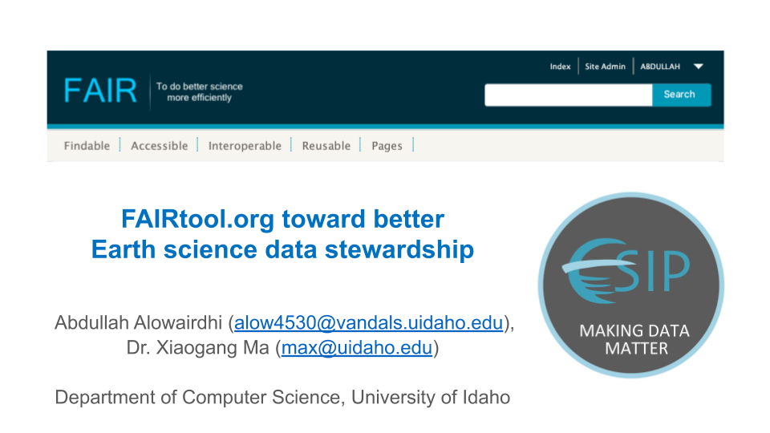
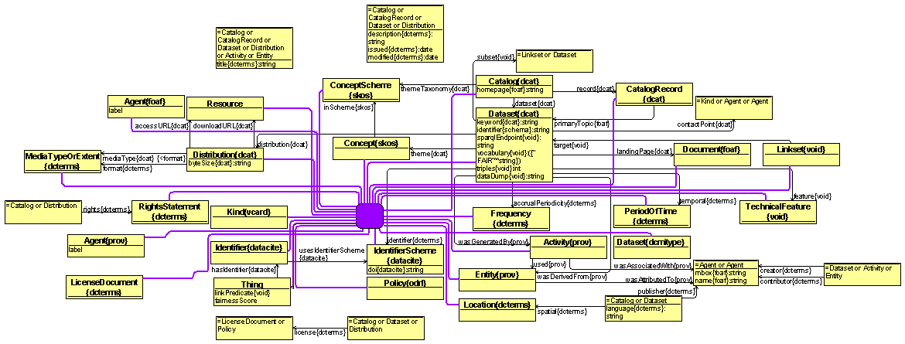

# FAIRTool.org

# Overview

FAIRTool is a semantic web application to provide stewardship to Earth science research output. The tool will implement the 15 FAIR principles. The core of FAIRTool is the FAIR-O Ontology which will be built following these 15 FAIR principles. The web application will use FAIR-O Ontology to capture the properities equivilant to the 15 FAIR principle and display them as metadata. Through a technical pipeline, a score for each principle will be calculated and displayed as the FAIRness score of that research output. The created metadata record from the FAIRTool can be downloaded as RDF file. The FAIRTool can be used by both researchers and data managers, as well as other users.

FAIRTool (FAIRTool.org) is a framework that provides metadata conforms to FAIR principles. FAIRTool uses a composition of well-known ontologies (e.g. Schema.org, DCAT, PROV, FOAF, VOID, SKOS, VCARD, ODRL), semantic web technologies, web application, and a database for creating, storing and serving FAIR metadata of research output.

FAIRtool.org is a semantic web application that allows data creators to describe a dataset with FAIR metadata and, in the other side, allows data users to discover information (metadata) about the offered datasets and, if the data is open access, the actual data can be retrieved.

The FAIRTool application is being initially developed as a stand-alone web application. However, the SPARQL endpoint of the FAIRTool can be also accessed from other applications to provide FAIR metadata accessibility of the datasets.

* The 15 FAIR principles (Wilkinson et al., 2016)

# Timeline

  - Feb.- Mar., 2019 Project plan report; Architecture design; Ontologies bulding, Application creation and integration.
  - Apr.- Jun., 2019 Write program codes; Triple store setup;  development.
  - Jul., 2019 Online testing, debugging and implementation of deliverables; 
  - Jul. 18, 2019 Presenting FAIRtool.org at ESIP 2019 summer meeting.
  - Aug., 2019 Project final report writing.
  - Sep. - Oct. 2019 FAIRtool.org online Beta release, accepting access requests for usernames to ESIP community
  - Nov. - Dec. 2019 Aplication tune up and final release.  
  - Jan. - 2020 Present the Earth science scientific dataset's metadata case study output at ESIP 2020 winter meeting.

# Goals
The main objective of this project is to produce human/machine-readable FAIR metadata for the digital data outputs of the Earth science community research. 

- The end result will be a tool that will promote the Earth science community research outputs toward better data stewardship.

  - Enable the Earth science community data owners to show their dataset’s metadata in a way that conforms with the FAIR Metadata Guiding Principles.
  
  - Enable the Earth science community data owner to measure the FAIRness of their dataset's metadata.
  
  -	Enable Earth science community data consumers to search and find information about the dataset and its offered metadata.
  
  - Enable Earth science community data consumers to discover information (metadata) about the offered datasets and, if the data is open access, the  actual data can be retrieved.
  
  - Enable individual researchers or groups to evaluate and improve the FAIRness of their dataset's metadata. 

  - Enable integration for both humans (GUI) and software agents (SPARQL end pint), e.g. Integration with Google dataset search.

# Measures of outreach 

The work augment the active discussion on FAIR Principles by providing an executable implementation.

- The FAIRTool poster was presented at the 2nd U.S. Semantic Technologies Symposium (US2TS 2019) that took place between March 11-13, 2019 at Duke University, Durham, North Carolina.

# @esip.figshare.com (97 views, 16 Downloads)

https://esip.figshare.com/articles/Toward_an_implementable_framework_of_FAIR_principles_for_Earth_science_data_management_and_stewardship/7949441/1

# ESIP 2019 summer meeting

* FAIRtool.org was presented at ESIP 2019 summer meeting.

# Impact of project deliverables

# Architecture

The FAIRTool Ontology model is a composition of DCAT, DCT, VoID, PROV, FOAF, SKOS Schema.org, CompNet, and ODRL 

# FAIRTool main components 

- MySql database, it holds and relates information on research output artifacts (e.g., data and software, and more).
  - Create the database
  > mysql -u root -p
  > CREATE DATABASE FAIRdb CHARACTER SET utf8;
  > GRANT ALL ON FAIRdb.* TO 'fairUser'@'localhost' IDENTIFIED BY 'fairPass';
   
- As a web application, it provides intelligence and reporting on Earth Science community research output artifacts. 
- Through its integration to other registration systems (e.g., DOI, ORCID, CC, etc.), via APIs it produces essential information vital to FAIR metadata system.  
- Through its API and SPARQL endpoint, it supports data mining for special purpose and ad hoc needs.  
- Through linked data, it is one of the Earth science community face to the Web of Data. 
- With small update, it can also be applied to data in other disciplines. 

Proposed FAIRTool Architecture: 

- Data Pipeline fetched from multiple known sources via APIs, then loads into the FAIR triple datastore. 
- FAIR-O Ontology describes the FAIR classes and the relation between classes to form a FAIR metadata of the Earth Science community research output.  
- FAIR Triple Datastore allows storing, indexing, and hold complex relationship between entities as well as real-time  population of downstream datastores (e.g., representations for web app usage); 
- GUI Web Application exposes FAIR metadata reports, & landing pages for FAIRTool entities sufficient to satisfy the 15 FAIR principles requirements combined with FAIRness score.

Tech Selections: 

- Data Pipeline: Integration APIs provided from DataCite, ORCID, Creative Commons, and others. 
- Triple Datastore: Vitro with Jena and OpenLink’s virtuoso. 
https://vivoweb.org/info/about-vitro   
- Web App/GUI: Java scripts, and Freemarker. 
- Web Server: Apache Tomcat 
